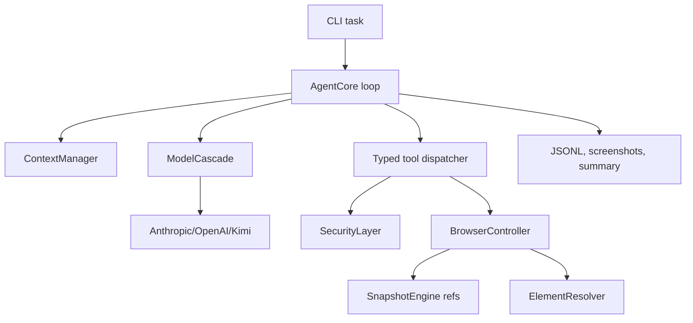

# AI Browser Agent

Visible Playwright browser agent for the VLR test task. The implementation is browser-first, ref-based, and provider-neutral across Anthropic, OpenAI and Kimi K2.6 tool calling.

The agent does not contain real-site scripts, routes, selectors, or task flows. It observes the current page, gives the model compact element refs, executes deterministic Playwright actions through those refs, and gates risky side effects through a safety layer.

## What Is Implemented

- Visible Chromium by default, with persistent Playwright profile sessions.
- CLI task input, interactive mode, profile login helper, doctor, and replay.
- Compact DOM/accessibility-like snapshot engine with current-step refs.
- Frame-aware snapshots with scoped refs such as `f1:e2` for iframe elements.
- Ref resolver with stale-ref recovery fallbacks and lexical `query_dom`.
- Typed model-facing tools with Pydantic validation.
- Anthropic, OpenAI and Kimi K2.6 adapters with normalized tool calls.
- Model cascade roles: fast, primary, strong, vision.
- Sub-agent structure: planner, explorer, executor, extractor, critic and safety reviewer.
- Security layer for destructive, sending, upload, checkout, payment, credentials and handoff actions.
- Context manager with trusted/untrusted separation and compaction.
- Failure screenshots and no-progress warnings for expected-changing actions.
- JSONL event log, screenshots, summaries, trace/video options.
- Local fixture server for deterministic demos and tests.

## Setup

```bash
python3 -m venv .venv
. .venv/bin/activate
python -m pip install -e ".[dev]"
python -m playwright install chromium
cp .env.example .env
```

Set the Kimi provider key in `.env`:

```bash
AI_BROWSER_PROVIDER=kimi
KIMI_API_KEY=...
KIMI_BASE_URL=https://api.moonshot.ai/v1
AI_BROWSER_FAST_MODEL=kimi-k2.6
AI_BROWSER_PRIMARY_MODEL=kimi-k2.6
AI_BROWSER_STRONG_MODEL=kimi-k2.6
AI_BROWSER_VISION_MODEL=kimi-k2.6
AI_BROWSER_KIMI_THINKING=disabled
AI_BROWSER_KIMI_STRONG_THINKING=enabled
AI_BROWSER_LLM_TPM_LIMIT=50000
```

Kimi K2.6 uses Moonshot's OpenAI-compatible Chat Completions endpoint. The client sends `prompt_cache_key` on every model turn in a run and uses Kimi's documented base64 `image_url` format for screenshots. Routine fast/primary/vision steps keep thinking disabled to control spend; strong-model escalation and final verification use `AI_BROWSER_KIMI_STRONG_THINKING=enabled`.

When a run calls `take_screenshot`, the next Kimi chat request attaches the screenshot as an image payload, so K2.6 can inspect the actual browser pixels instead of only seeing a file path.

Run environment checks:

```bash
ai-browser-agent doctor
```

If you need a non-visual check in CI:

```bash
ai-browser-agent doctor --headless
```

## Persistent Login Flow

Open a browser profile, log in manually, then close it:

```bash
ai-browser-agent profile login --profile ./profiles/demo --url https://example.com
```

Reuse the same profile for a task:

```bash
ai-browser-agent run \
  --profile-dir ./profiles/demo \
  --provider kimi \
  --task "Open the requested service, inspect the page, prepare the requested action, and stop before any final external side effect."
```

### Google/Gmail Login via Chrome CDP

Google can reject the default Playwright Chromium login with "this browser or app may not be secure".
For Gmail, use a normal Chrome process with remote debugging and a dedicated user-data directory.

You do not need to log in every time if you reuse the same Chrome profile directory:

```bash
--user-data-dir="$(pwd)/profiles/gmail-cdp"
```

The browser session is stored in `profiles/gmail-cdp`. If Chrome is closed, start it again with the
same profile and CDP port:

```bash
/Applications/Google\ Chrome.app/Contents/MacOS/Google\ Chrome \
  --remote-debugging-port=9222 \
  --user-data-dir="$(pwd)/profiles/gmail-cdp" \
  https://mail.google.com
```

After logging in manually in that Chrome window, run the agent from another terminal:

```bash
ai-browser-agent run \
  --cdp-url http://127.0.0.1:9222 \
  --task "Delete the latest email from Cerebral Valley and stop immediately after the successful deletion."
```

Do not use your everyday Chrome profile for automation. Keep a dedicated profile such as
`profiles/gmail-cdp` so the agent session is isolated and repeatable.

## Local Demo Fixture

Start local fixtures:

```bash
python -m ai_browser_agent.evals.fixtures.server --port 8765
```

In another terminal:

```bash
ai-browser-agent run --provider kimi --task \
  "Open http://127.0.0.1:8765/delivery. Add the BBQ burger and French fries to the cart, go to checkout, but stop before final payment."
```

For no-key plumbing tests, use:

```bash
ai-browser-agent run --provider fake --headless --task "Smoke test"
```

`fake` does not solve real tasks; it only validates CLI/logging wiring.

Deterministic browser smoke without an LLM:

```bash
python -m ai_browser_agent.evals.run_eval --browser-smoke
```

This checks fixture navigation, ref clicks, iframe refs and hidden prompt-injection detection.

## Demo Task Prompts

Use a dedicated persistent profile, log in manually first, and then run visible, non-headless tasks with `--profile-dir`.

```bash
ai-browser-agent profile login --profile ./profiles/demo-mail --url https://mail.yandex.ru
ai-browser-agent run --provider kimi --profile-dir ./profiles/demo-mail --task \
  "Открой почту в текущем профиле, изучи последние 10 писем во входящих, составь список кандидатов на спам с отправителем, темой и причиной. Перед удалением или пометкой как спам запроси подтверждение; без подтверждения ничего не удаляй. В конце дай краткий отчет."
```

```bash
ai-browser-agent profile login --profile ./profiles/demo-food --url https://eda.yandex.ru
ai-browser-agent run --provider kimi --profile-dir ./profiles/demo-food --task \
  "Открой сервис доставки в текущем профиле. Найди BBQ-бургер и картошку фри из подходящего ресторана, добавь выбранные позиции в корзину, проверь состав корзины и дойди до checkout. Не отправляй заказ и не оплачивай без моего явного подтверждения; остановись перед финальным подтверждением оплаты."
```

```bash
ai-browser-agent profile login --profile ./profiles/demo-hh --url https://hh.ru
ai-browser-agent run --provider kimi --profile-dir ./profiles/demo-hh --task \
  "Открой hh.ru в текущем профиле, изучи мое резюме/профиль, найди 3 релевантные вакансии AI-инженера, извлеки название, компанию, ссылку и ключевые требования. Подготовь персонализированное сопроводительное письмо для каждой вакансии, но перед отправкой отклика запроси подтверждение и без подтверждения ничего не отправляй."
```

Local fixture for a cheap no-risk food checkout smoke:

```bash
python -m ai_browser_agent.evals.fixtures.server --port 8765
ai-browser-agent run --provider kimi --task \
  "Open http://127.0.0.1:8765/delivery. Add the BBQ burger and French fries to the cart, go to checkout, verify the cart contents, and stop before final payment."
```

## Tool Surface

The model can call:

- `observe`
- `query_dom`
- `take_screenshot`
- `navigate`
- `click`
- `type_text`
- `press_key`
- `scroll`
- `select_option`
- `extract`
- `wait`
- `ask_user`
- `handoff_to_user`
- `done`

Side-effecting tools require an `intent`. Tool results return concise summaries plus structured error metadata and recovery hints.

## Context Strategy

Normal observations never send raw full HTML. The model receives:

- trusted user task;
- current plan and compact memory;
- recent tool summaries;
- current page summary with refs, roles, names, short text chunks, bounding boxes and page stats;
- page content explicitly labeled as untrusted.

Long runs compact older actions into memory while preserving the original task, plan, safety policy and latest observation. `extract` is the explicit path for longer page text and returns query-specific evidence snippets, source refs, optional rough structured fields and cached results keyed by URL, query and page fingerprint.

## Safety Policy

The safety layer treats browser/page/email/document content as untrusted. It confirms or hands off actions involving deletion, sending, submitting, posting, uploads, account changes, checkout, final payment, credentials, 2FA, CAPTCHA, and browser/site safety warnings.

Examples:

- preparing a cart is allowed;
- final payment is handoff/critical;
- identifying messages for cleanup is allowed;
- moving messages to trash requires confirmation;
- drafting a form is allowed;
- submitting it to a third party requires confirmation.

## Artifacts

Each run writes `runs/<timestamp>-<task-slug>/`:

- `events.jsonl`
- `summary.md`
- `state.json`
- `screenshots/`
- optional `trace.zip`
- optional Playwright video

Replay a run:

```bash
ai-browser-agent replay runs/<run-id>
```

## Tests

```bash
pytest
python scripts/check_no_hardcoded_flows.py
python -m ai_browser_agent.evals.run_eval --browser-smoke
```

The hardcode audit scans agent source for real-service domains, route hints, selector hints, and demo-task terms. Fixture/demo files are excluded because they are test targets, not agent logic.

## Architecture



## Limitations

- No CAPTCHA bypass or stealth automation.
- Real services can block automation; persistent visible profiles are the intended mitigation.
- The DOM snapshot now includes iframe refs, but highly dynamic nested frames can still require resnapshoting or handoff.
- The model quality determines real-site task success.

## Submission Notes

The implementation was developed with AI coding assistance, which matches the assignment expectation. Research notes and tradeoffs are captured in `SPEC.md`; the implementation follows `PLAN.md` with a working MVP focus.
