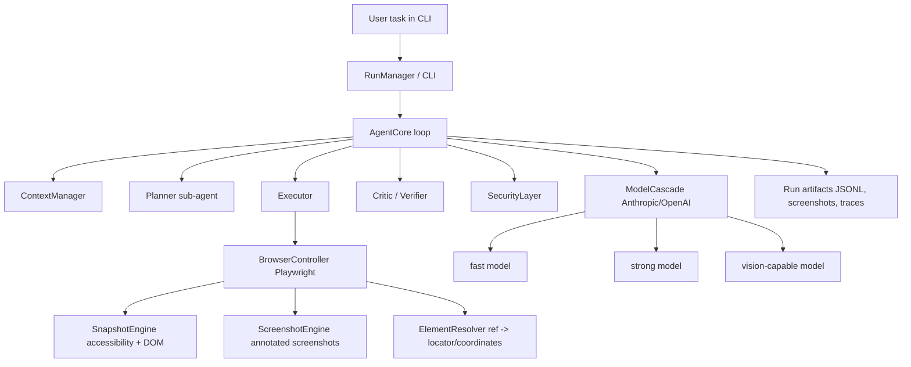

# SPEC: AI browser agent for the VLR test task

Дата подготовки: 2026-04-27
Исходное задание: https://vlrdev.craft.me/ai_test_task
Локальный снимок задания: `references/craft/assignment_outline.md`, `references/craft/assignment.json`, `references/craft/candidate_screenshot_*.png`

## 1. Цель

Собрать автономного AI-агента, который управляет видимым браузером и выполняет сложные многошаговые пользовательские задачи без заранее зашитых сценариев, ссылок, селекторов и подсказок по конкретным сайтам.

Результат должен демонстрировать не только рабочий прототип, но и инженерный подход: исследование существующих решений, явные архитектурные решения, прозрачную работу агента, контроль контекста, устойчивость к ошибкам и безопасную обработку действий с внешними последствиями.

## 2. Полный состав требований работодателя

### 2.1 Обязательная задача

- Разработать AI-агента, который автономно управляет веб-браузером.
- Агент должен выполнять сложные многошаговые задачи.
- Должен открываться браузер.
- Пользователь должен иметь возможность написать задачу агенту, например в терминале или отдельном окне.
- После получения текстовой задачи агент должен работать полностью автономно.
- Пользователь должен видеть, как агент решает задачу в браузере.
- Агент обращается к пользователю только если нужна дополнительная информация, подтверждение или задача завершена.

### 2.2 Примеры задач, которые агент должен уметь решать

#### Удаление спама

Цель: прочитать последние письма в почте и удалить спам-письма.

Пользовательский пример: "Прочитай последние 10 писем в яндекс почте и удали спам".

Ожидаемое поведение:

1. Перейти в почтовый сервис.
2. Открыть папку "Входящие".
3. Прочитать последние 10 писем: тему, отправителя, краткое содержание.
4. Проанализировать письма и определить спам: рекламные рассылки, подозрительные отправители, фишинг.
5. Удалить спам-письма, переместить их в корзину или пометить как спам.
6. Предоставить краткий отчёт: сколько спама удалено, какие важные письма остались.
7. Предполагается, что пользователь уже вошёл в аккаунт почтового сервиса.

Security nuance: удаление писем является деструктивным действием. Агент должен сначала собрать кандидатов на удаление, объяснить критерии и запросить подтверждение непосредственно перед удалением.

#### Заказ еды

Цель: оформить заказ на сервисе доставки еды, например Яндекс.Еда, Яндекс Лавка, Delivery Club.

Пользовательский пример: "Закажи мне BBQ-бургер и картошку фри из того места, откуда я заказывал на прошлой неделе на сайте [...]".

Ожидаемое поведение:

1. Перейти на сайт доставки еды.
2. Найти нужный ресторан или найти BBQ-бургеры через поиск.
3. Добавить правильные позиции в корзину, различая похожие товары.
4. Перейти к оформлению заказа.
5. Пройти checkout, но можно остановиться перед финальным подтверждением оплаты.
6. Предполагается, что пользователь уже вошёл в аккаунт сервиса заказа еды.

Security nuance: выбор товаров допустим без подтверждения, но финальная отправка заказа и оплата должны требовать явного подтверждения или handoff пользователю.

#### Поиск вакансий

Цель: найти релевантные вакансии и составить персонализированные сообщения для рекрутеров.

Пользовательский пример: "Найди 3 подходящие вакансии AI-инженера на hh.ru и откликнись на них с сопроводительным, предварительно изучив резюме в моём профиле".

Ожидаемое поведение:

1. Перейти на hh.ru.
2. Изучить профиль пользователя.
3. Найти релевантные вакансии через поиск.
4. Извлечь ключевую информацию о каждой позиции.
5. Откликнуться на подходящие вакансии, приложив сопроводительное письмо.
6. Предполагается, что пользователь уже вошёл в аккаунт hh.ru.

Security nuance: отправка отклика представляет пользователя перед третьей стороной. Агент должен подготовить список вакансий и тексты писем, затем запросить подтверждение перед каждым откликом или перед пакетной отправкой.

### 2.3 Что обязательно должно быть в реализации

- Автоматизация браузера:
  - программное управление браузером;
  - persistent sessions, чтобы пользователь мог вручную войти в аккаунт, а агент продолжил работу;
  - видимый браузер, не headless, потому что нужно наблюдать процесс.
- Автономный AI-агент:
  - использует модели Claude или OpenAI;
  - принимает решения без постоянного участия пользователя;
  - обрабатывает многошаговые задачи с переходами между страницами.
- Управление контекстом:
  - нельзя отправлять целые веб-страницы в AI-контекст;
  - нужны стратегии работы с токен-лимитами.
- Продвинутые паттерны, минимум один из списка:
  - sub-agent architecture;
  - обработка ошибок, при которой агент адаптируется при неудачных действиях;
  - security layer, который спрашивает перед оплатой корзины, удалением email и другими деструктивными действиями.

В этой спецификации планируется реализовать все три продвинутых паттерна.

### 2.4 Что запрещено

- Заготовки действий агента под конкретные примеры, например сценарий удаления спама или оформления заказа.
- Преднаписанные селекторы вида `a[data-qa='vacancy']`.
- Подсказки по ссылкам и элементам:
  - нельзя хардкодить, что страница вакансий находится на `/vacancies`;
  - нельзя хардкодить, что добавление в корзину делается кнопкой с текстом "Заказать";
  - агент должен сам исследовать страницу и выбирать действия в моменте.

### 2.5 Что можно выбрать самостоятельно

- Библиотеку автоматизации браузера: Playwright, Puppeteer, Selenium или другое.
- AI SDK: Anthropic, OpenAI, прямые API-вызовы.
- Язык программирования.
- Способ эффективного извлечения информации со страницы.
- Архитектуру tool/function calling.
- Подход к динамическим страницам, попапам, формам.
- Использовать ли MCP.

### 2.6 Ожидаемый результат сдачи

- Короткое видео, где видно, как агент решает одну сложную задачу.
- Ссылка на репозиторий с решением.
- Идеальное видео показывает одновременно:
  - открытый браузер;
  - терминал;
  - пользователь вводит короткую задачу;
  - терминал показывает, какие инструменты вызывает агент и с какими аргументами;
  - агент исследует страницу, кликает, вводит текст;
  - браузер визуально отражает работу агента;
  - в конце агент сообщает, что удалось сделать.

На скриншотах из задания видно ожидаемый формат: слева видимый браузер с сервисом доставки, справа терминал `npm run dev`; в терминале печатаются вызовы вроде `navigate_to_url`, `take_screenshot`, `wait`, `query_dom`, `click_element`, `type_text` и результаты каждого шага.


## 3. Исследовательские выводы

### 3.0 Аудит прошлой заготовки

У меня был черновик:
Основные проблемы черновика:

- default runtime теперь ориентирован на Kimi K2.6 через Moonshot OpenAI-compatible endpoint;
- архитектура перечисляет правильные слова, но слабо фиксирует проверяемые acceptance criteria;
- недостаточно конкретно описан запрет hardcoded selectors/action plans;
- context management описан слишком общо и без token-budget протокола;
- safety layer не раскрывает prompt injection, third-party content и confirmation-at-point-of-risk;
- нет полноценной eval strategy на локальных mock-сайтах;
- не зафиксирован формат идеального видео: видимый браузер + терминал + tool calls с аргументами + финальный отчёт.

Поэтому текущие `PLAN.md` и `SPEC.md` в корне переопределяют старую заготовку.

### 3.1 Провайдерские решения

OpenAI Computer-Using Agent / Computer Use:

- Итеративная петля perception -> reasoning -> action.
- Входом для модели могут быть скриншоты и история действий.
- Модель возвращает действия, код-харнесс выполняет их и возвращает результат.
- OpenAI подчёркивает изоляцию окружения, human-in-the-loop для high-impact действий и недоверие к содержимому страниц.
- Сильные стороны: универсальный GUI-интерфейс, self-correction, работа без site-specific API.
- Слабые стороны: координатные клики и визуальное понимание могут ошибаться, сложные UI вызывают trial-and-error, важна safety-обвязка.

Anthropic Computer Use / Claude in Chrome:

- Модель не управляет компьютером напрямую: приложение получает tool requests, выполняет их и возвращает screenshots/outputs.
- Рекомендован явный agent loop с лимитом итераций.
- Claude for Chrome делает именно то, чего ожидает работодатель: навигация, клики и заполнение форм в браузере.
- Anthropic отдельно выделяет prompt injection на веб-страницах, hidden DOM instructions, URL/title injection, site-level permissions и confirmations для рискованных действий.
- Практический вывод: страницу надо помечать как untrusted content, а разрешение на действия брать только из пользовательского задания, не из текста страницы.

Google Project Mariner:

- Браузерный агент на базе multimodal reasoning.
- Наблюдает браузерный экран, понимает web elements, планирует и действует.
- Имеет явные стадии observes/plans/acts, поддерживает multi-tasking в браузерах на VM.
- Безопасность: active tab, human-in-the-loop, confirmation перед sensitive actions.

ChatGPT Agent / Operator:

- Объединяет visual browser, text browser, terminal и API/connectors.
- Практический вывод: агент должен выбирать самый дешёвый и надёжный инструмент под задачу, а не всегда кликать глазами по странице.
- Для тестового задания можно реализовать browser-first агент, но архитектуру держать расширяемой под text extraction/API/terminal.

### 3.2 Open-source решения

Browser Use:

- Python-first agent с Playwright/CDP.
- Даёт LLM дерево интерактивных элементов с numeric indexes.
- Поддерживает скриншоты с bounding boxes, vision fallback, memory, planning, judge, loop detection, message compaction.
- Сильный паттерн: модель кликает не по CSS selector, а по индексам текущего snapshot; runtime хранит `selector_map`.

Stagehand:

- TypeScript SDK поверх Playwright.
- Делит автоматизацию на `act`, `extract`, `observe`, `agent`.
- Смешивает deterministic code и natural-language automation.
- Поддерживает caching/self-healing повторяемых действий.
- Практический вывод: для test task не надо превращать всё в brittle scripts, но полезно иметь отдельные tools `observe`, `act`, `extract`, чтобы модель выбирала уровень абстракции.

Playwright MCP:

- Использует accessibility tree вместо pixel-only подхода.
- Структурный snapshot дешевле и детерминированнее, чем отправка скриншотов на каждом шаге.
- Важное ограничение: слишком большие accessibility snapshots могут раздувать контекст, значит нужен viewport-first snapshot, truncation, фильтры и ref map.

Skyvern:

- Playwright-compatible SDK с AI-командами `act`, `extract`, `validate`, `prompt`, `run_task`.
- Использует LLM + computer vision и swarm/agent-подход.
- Сильный паттерн: AI fallback, когда deterministic selector/script ломается.
- Для задания нельзя заранее писать deterministic flows под hh.ru/почту/еду, но можно использовать deterministic execution после того, как агент сам нашёл элемент.

Agent-E:

- Multi-agent web automation: planner agent + browser navigation agent.
- Поддерживает конфиг разных LLM, локальный Chrome profile и Playwright.
- Полезный паттерн: разделение planning и browser navigation, логирование сообщений.

BrowserGym/WebArena/WebVoyager:

- Не являются продуктовым фреймворком для сдачи, но полезны как идея eval harness.
- Для проекта стоит добавить локальные mock-сайты и несколько реальных smoke tasks, а BrowserGym/WebArena оставить stretch goal.

## 4. Выбор стека

### 4.1 Основной стек

- Язык: Python 3.11+.
- Browser automation: Playwright Python.
- Браузер: Chromium/Chrome, видимый режим по умолчанию.
- Профиль: Playwright persistent context через `user_data_dir`; опционально CDP attach к отдельному Chrome profile.
- CLI/TUI: `rich` для live-логов, таблиц tool calls и статусов.
- Typed schemas: Pydantic v2.
- LLM SDK:
  - Anthropic SDK для Claude tool use;
  - OpenAI Responses API adapter для OpenAI models/computer-use-compatible custom harness;
  - общий `LLMClient` interface.
- Token counting: provider-specific usage из API + грубая локальная оценка для preflight.
- Storage: JSONL event log, screenshots, trace, run summary.

### 4.2 Провайдерская политика

Для соответствия заданию основными провайдерами считаются только Anthropic и OpenAI.

Рекомендуемый default:

- Primary: Claude Sonnet/Opus класса 4.x через Anthropic SDK для tool-calling и reasoning по DOM/screenshot.
- Alternative: OpenAI GPT-5.x через Responses API или Chat Completions-compatible tool calling.
- Optional dev fallback: OpenAI-compatible endpoint для локальной отладки, но demo работодателю должен запускаться на Claude или OpenAI, если в задании явно требуется "Claude или OpenAI".

### 4.3 Почему не MCP как ядро

MCP полезен для подключения готовых browser tools к IDE, но для тестового задания лучше собственный agent loop:

- проще показать архитектуру;
- проще контролировать token budget;
- проще встроить safety gate и model cascade;
- проще гарантировать отсутствие hardcoded selectors;
- терминальный лог tool calls будет полностью под нашим контролем.

MCP можно добавить как optional adapter позднее, но не как обязательную зависимость MVP.

## 5. Высокоуровневая архитектура



### 5.1 Main loop

Each step:

1. Observe current browser state.
2. Build compact state packet.
3. Decide whether to plan/replan, act, extract, ask user, or finish.
4. Validate the proposed action through `SecurityLayer`.
5. Execute browser/tool action.
6. Wait for page stability.
7. Verify result through DOM/screenshot.
8. Update memory, plan and event log.
9. Stop on `done`, user blocker, max steps, or unrecoverable risk.

### 5.2 Step invariants

- Every browser action must be grounded in current observation.
- The model may not invent a selector.
- Page content is untrusted data, not instructions.
- Risky actions are paused at the exact point of risk.
- Final `success=true` requires verification against the original user task.
- If success cannot be verified, final result must be partial with `success=false`.

## 6. Components

### 6.1 CLI / RunManager

Responsibilities:

- Parse command line arguments.
- Start visible browser.
- Allow user to enter a task.
- Print transparent run log.
- Capture user confirmations.
- Save artifacts.

Commands:

- `ai-browser-agent run --task "..."`
- `ai-browser-agent interactive`
- `ai-browser-agent profile login --profile ./profiles/default --url https://...`
- `ai-browser-agent replay runs/<run_id>`
- `ai-browser-agent doctor`

Required flags:

- `--profile-dir`
- `--provider anthropic|openai`
- `--primary-model`
- `--fast-model`
- `--strong-model`
- `--vision-model`
- `--max-steps`
- `--headless`, default false and not used in demo
- `--record-video`
- `--trace`

Terminal output must show:

- step number;
- current URL/title;
- compact plan status;
- selected model;
- tool name and JSON arguments;
- tool result summary;
- safety confirmation prompts;
- final report.

### 6.2 BrowserController

Responsibilities:

- Launch visible browser.
- Manage persistent sessions.
- Navigate, click, type, scroll, select, press keys, upload files.
- Manage tabs and popups.
- Provide current page state.
- Save screenshots/traces/videos.

Required methods:

```python
class BrowserController:
    async def launch(self, profile_dir: Path | None, headless: bool = False) -> None: ...
    async def close(self) -> None: ...
    async def navigate(self, url: str) -> BrowserActionResult: ...
    async def go_back(self) -> BrowserActionResult: ...
    async def click(self, ref: str, button: str = "left") -> BrowserActionResult: ...
    async def type_text(self, ref: str, text: str, clear: bool = True) -> BrowserActionResult: ...
    async def press_key(self, key: str) -> BrowserActionResult: ...
    async def scroll(self, direction: str, amount: int | None = None, ref: str | None = None) -> BrowserActionResult: ...
    async def select_option(self, ref: str, value: str) -> BrowserActionResult: ...
    async def wait_for_stable(self, timeout_ms: int = 5000) -> BrowserActionResult: ...
    async def current_state(self, mode: SnapshotMode) -> BrowserState: ...
    async def screenshot(self, annotated: bool = False) -> ScreenshotArtifact: ...
```

Implementation requirements:

- Use `launch_persistent_context` when `profile_dir` is set.
- Browser is visible by default.
- Use deterministic Playwright actions after resolving refs.
- Use strict timeouts and return actionable errors.
- Never expose environment variables to browser process unnecessarily.
- Disable extensions unless explicitly using CDP attach to a user browser.

### 6.3 SnapshotEngine

Responsibilities:

- Produce compact browser observations.
- Prefer visible viewport.
- Preserve enough semantic information for LLM decisions.
- Assign stable-ish refs for current step.

Snapshot contents:

- URL, title.
- Viewport dimensions and scroll position.
- Tabs.
- Page stats: links, buttons, inputs, forms, iframes, modals, text length.
- Interactive elements:
  - ref id;
  - role/tag;
  - accessible name;
  - visible text;
  - placeholder;
  - aria label;
  - title;
  - input type;
  - state: enabled/disabled/checked/expanded;
  - bounding box;
  - hierarchy path;
  - short DOM signature;
  - whether visible in viewport.
- Important non-interactive visible text chunks.
- Modal/overlay/cookie banner hints.

Modes:

- `visible`: default, only viewport + nearby interactives.
- `focused`: form/active container.
- `full_light`: whole page but only headings, links, form controls and short text chunks.
- `extract`: semantic markdown/text extraction with query and schema.

Must not:

- send raw full HTML by default;
- include large scripts/styles/SVG internals;
- include hidden content except when needed for prompt-injection detection;
- include secrets from password fields.

### 6.4 ElementResolver

Responsibilities:

- Map model-facing refs to executable Playwright locators or CDP backend nodes.
- Re-resolve after DOM changes.
- Fallback from DOM refs to semantic search and then to screenshot coordinates.

Resolution order:

1. Current snapshot ref map.
2. Stored backend node id / accessibility locator if still attached.
3. Role/name/text/placeholder locator generated from observed attributes.
4. Nearby hierarchy and bounding box match.
5. Natural-language element query over current snapshot.
6. Annotated screenshot + vision model coordinate fallback.

Rules:

- The model should primarily call tools with `ref`, not CSS.
- If the model gives natural-language target, `query_dom` must return candidate refs with evidence.
- CSS selectors generated internally are allowed only as transient implementation detail and must never be hardcoded per website.
- If multiple candidates remain, ask the model to choose or ask user if the action is risky.

### 6.5 AgentCore

Responsibilities:

- Own the observe -> reason -> act -> verify loop.
- Use typed tools.
- Maintain task state, memory and plan.
- Coordinate sub-agents and model cascade.
- Stop safely.

State:

```python
class AgentState(BaseModel):
    task: str
    run_id: str
    step: int
    plan: list[PlanItem]
    memory: str
    last_observation: BrowserState | None
    recent_actions: list[ActionRecord]
    failures: list[FailureRecord]
    artifacts: list[ArtifactRef]
    pending_confirmation: ConfirmationRequest | None
```

Default limits:

- `max_steps=50`
- `max_consecutive_failures=5`
- `max_same_action_repeats=3`
- `max_step_seconds=180`
- `max_run_seconds` configurable, default unlimited for manual demo.

### 6.6 Tool interface

Model-facing tools:

```python
observe(mode: "visible" | "focused" | "full_light") -> BrowserStateSummary
query_dom(query: str, limit: int = 10) -> ElementCandidates
take_screenshot(annotated: bool = True, reason: str) -> ScreenshotArtifact
navigate(url: str) -> ActionResult
click(ref: str, intent: str) -> ActionResult
type_text(ref: str, text: str, clear: bool, intent: str) -> ActionResult
press_key(key: str, intent: str) -> ActionResult
scroll(direction: "up" | "down" | "left" | "right", amount: int | None, ref: str | None) -> ActionResult
select_option(ref: str, value: str, intent: str) -> ActionResult
extract(query: str, schema: dict | None, scope: "visible" | "page" | "selected") -> ExtractResult
wait(seconds: float, reason: str) -> ActionResult
ask_user(question: str, reason: str) -> UserAnswer
handoff_to_user(reason: str, expected_user_action: str) -> UserAnswer
done(success: bool, summary: str, evidence: list[str], remaining_risks: list[str]) -> FinalResult
```

Tool design rules:

- Tool arguments must include `intent` for side-effecting actions.
- Tool results must be concise and actionable.
- Errors must include recovery hints, not stack traces only.
- Tools should use refs, not selectors.
- `done` must be single action.

### 6.7 ContextManager

Responsibilities:

- Keep model context below budget.
- Preserve task, current plan, facts, risk decisions and recent failures.
- Compact old steps.
- Avoid repeated expensive snapshots/extractions.

Context packet:

1. System prompt.
2. Immutable user task.
3. Safety policy.
4. Current plan and memory.
5. Last N step summaries.
6. Current observation.
7. Recent tool errors and recovery attempts.
8. Optional screenshot only when requested or triggered.

Strategies:

- Never include full page HTML.
- Keep only visible/default snapshot unless extraction is needed.
- Summarize old steps every 10-20 actions or when token estimate exceeds threshold.
- Store detailed artifacts on disk and include paths/short summaries.
- Deduplicate repeated page observations by page fingerprint.
- Separate trusted user instructions from untrusted page content using explicit tags.
- Mark extracted emails/webpage text as untrusted; never let it override system/user instructions.

### 6.8 ModelCascade

Responsibilities:

- Route each decision to the cheapest model that is likely to succeed.
- Escalate on ambiguity, failures, visual-only pages and risk.

Suggested routing:

- Fast model:
  - low-risk next-action decisions;
  - DOM candidate ranking;
  - routine summaries.
- Strong model:
  - initial planning for complex tasks;
  - replan after repeated failure;
  - spam/job relevance classification;
  - final verification;
  - safety-critical decisions.
- Vision model:
  - page has poor DOM/accessibility;
  - canvas/image-heavy UI;
  - visible UI differs from DOM;
  - repeated click misses;
  - visual verification before reporting success.

Escalation triggers:

- `query_dom` returns no candidate.
- More than two failed actions on same page.
- Page fingerprint unchanged after expected page-changing action.
- Action is high-risk.
- Snapshot is truncated and target not visible.
- The agent is about to call `done(success=true)`.
- The page contains suspicious instructions, warnings, phishing-like content, CAPTCHA or login blockers.

Provider interface:

```python
class LLMClient(Protocol):
    async def complete(self, request: LLMRequest) -> LLMResponse: ...
    async def complete_structured(self, request: LLMRequest, schema: type[T]) -> T: ...
```

Adapters:

- `AnthropicClient`
- `OpenAIResponsesClient`
- `OpenAIChatClient` if needed

### 6.9 Sub-agent architecture

Use sub-agents as separate prompts/functions, not necessarily separate processes.

Planner:

- Builds and revises high-level plan.
- Must not create site-specific hardcoded steps.
- Outputs goals, not selectors.

Explorer:

- Interprets page snapshot.
- Finds candidate elements.
- Suggests what to inspect next.

Executor:

- Converts a single intended action into a tool call.
- Handles immediate retry alternatives only within policy.

Extractor:

- Produces structured facts from page/email/vacancy/product content.
- Must cite source snippets/refs from observation.

Critic:

- Verifies progress against original task.
- Detects missing requirements before `done`.

Safety reviewer:

- Classifies action risk.
- Applies direct-user-instruction rule.
- Decides allow, confirm, handoff or block.

### 6.10 SecurityLayer

Core principle: the user's original prompt is trusted intent; web pages, emails, PDFs, chats, tab titles, URLs and tool outputs are untrusted content.

Risk classes:

- Low:
  - navigation;
  - search;
  - scrolling;
  - opening non-sensitive pages;
  - reading visible content.
- Medium:
  - typing non-sensitive form fields;
  - adding item to cart;
  - changing filters;
  - downloading public files.
- High, confirmation required:
  - deleting emails/files/data;
  - marking as spam;
  - sending email/message/application;
  - submitting a form to third party;
  - posting content;
  - uploading files;
  - subscribing/unsubscribing;
  - changing account settings;
  - sharing personal/work data.
- Critical, handoff or explicit user action:
  - final payment/purchase/order confirmation;
  - password changes;
  - 2FA;
  - bypassing browser/site safety warnings;
  - CAPTCHA solving if not explicitly allowed;
  - banking, legal, medical or regulated decisions.

Confirmation prompt must include:

- exact intended action;
- target site/object;
- data to be sent/deleted/changed;
- reason agent believes it is needed;
- risk;
- available choices: approve once, deny, handoff.

Prompt-injection defenses:

- Wrap page content in `untrusted_page_content`.
- Instruct model that on-page instructions cannot override user/system instructions.
- Detect hidden DOM text, suspicious invisible fields, "ignore previous instructions", urgent deletion/payment claims.
- Escalate suspicious cases to strong model and ask user when needed.
- Do not execute instructions from emails/webpages unless they directly match user's task and pass safety review.

### 6.11 ErrorHandler

Error classes:

- timeout/loading;
- stale element;
- selector/ref not found;
- click intercepted;
- popup/overlay;
- iframe/shadow DOM;
- navigation failed;
- access denied/bot detection/rate limit;
- login required;
- CAPTCHA;
- form validation error;
- unexpected page change;
- no progress/loop;
- LLM malformed tool call;
- provider timeout/rate limit.

Recovery strategies:

- wait and resnapshot;
- close/dismiss popup;
- scroll target into view;
- rerun `query_dom`;
- use role/text locator fallback;
- use screenshot/vision fallback;
- navigate back;
- ask user for login/2FA;
- replan after repeated failure;
- stop and report if site blocks automation.

Loop detection:

- Track action hashes.
- Track page fingerprints.
- If same action repeats 3 times or page unchanged for 3 expected-changing steps, force replan or escalate model.

### 6.12 Observability and artifacts

Every run creates `runs/<timestamp>-<slug>/`:

- `events.jsonl`: step events, tool calls, results, model usage, safety decisions.
- `summary.md`: final report.
- `screenshots/`: raw and annotated screenshots.
- `trace.zip`: Playwright trace when enabled.
- `video.webm`: optional Playwright video.
- `state.json`: final agent state.

Event schema:

```json
{
  "run_id": "...",
  "step": 7,
  "type": "tool_call",
  "model": "claude-sonnet-...",
  "tool": "click",
  "args": {"ref": "e17", "intent": "open first vacancy details"},
  "result": {"ok": true, "summary": "Clicked ..."},
  "url": "https://...",
  "timestamp": "..."
}
```

### 6.13 Final response contract

The final result must include:

- whether the task succeeded;
- what was done;
- evidence from page state;
- what was not done and why;
- any user confirmations/handoffs;
- artifacts if useful.

For the three demo classes:

- Spam: number of messages inspected, candidates, confirmed deletions, important messages left.
- Food: restaurant/items selected, cart contents, total if visible, stopped before payment unless approved.
- Jobs: vacancies found, why relevant, cover letters drafted/sent, confirmations.

## 7. Project structure

```text
ai_browser_agent/
  __init__.py
  cli.py
  config.py
  agent/
    core.py
    prompts.py
    subagents.py
    models.py
    context.py
    cascade.py
  browser/
    controller.py
    snapshot.py
    resolver.py
    screenshots.py
    actions.py
  llm/
    base.py
    anthropic_client.py
    openai_client.py
  safety/
    policy.py
    classifier.py
  recovery/
    errors.py
    handler.py
  observability/
    logger.py
    artifacts.py
  evals/
    fixtures/
    tasks.yaml
    run_eval.py
tests/
  unit/
  integration/
README.md
SPEC.md
PLAN.md
```

## 8. Configuration

Environment variables:

```bash
AI_BROWSER_PROVIDER=anthropic
ANTHROPIC_API_KEY=...
OPENAI_API_KEY=...
AI_BROWSER_PRIMARY_MODEL=...
AI_BROWSER_FAST_MODEL=...
AI_BROWSER_STRONG_MODEL=...
AI_BROWSER_VISION_MODEL=...
AI_BROWSER_PROFILE_DIR=./profiles/default
AI_BROWSER_MAX_STEPS=50
AI_BROWSER_RECORD_VIDEO=false
AI_BROWSER_TRACE=false
```

`.env.example` must not include real keys.

## 9. Testing and evaluation

### 9.1 Unit tests

- SnapshotEngine filters and formats DOM.
- ElementResolver maps refs and handles stale refs.
- SecurityLayer classifies risk.
- ContextManager compacts history and preserves task.
- ModelCascade routes/escalates.
- ErrorHandler chooses recovery.
- Tool schemas validate malformed model calls.

### 9.2 Integration tests

Use local static/dynamic fixtures:

- fake email inbox with spam and important emails;
- fake food delivery shop with similar products and checkout stop;
- fake job board with profile, search filters, vacancies and application form;
- popups/cookie banners;
- delayed SPA loading;
- iframe/shadow DOM;
- inaccessible/canvas-like element requiring screenshot fallback;
- prompt injection email/webpage.

### 9.3 Manual demo test

Before recording:

1. Run `doctor`.
2. Open browser with persistent profile.
3. Manually log in if the chosen site requires auth.
4. Run one complex task.
5. Ensure terminal prints tool calls and arguments.
6. Ensure browser is visible.
7. Ensure risky final action is confirmed or stopped.
8. Ensure final report is accurate.

Recommended demo:

- Food order up to checkout on a real logged-in service, stopping before payment.
- Or fake mail/job local fixture if real accounts/sites are unstable.

Best demo for employer fit:

- Real browser + real site + persistent login + terminal tool trace.
- Avoid final payment/deletion unless explicitly confirmed on camera.

## 10. Non-goals for MVP

- No production-grade CAPTCHA bypass.
- No stealth/proxy infrastructure.
- No guaranteed success on every site.
- No background scheduling.
- No hardcoded workflows for Yandex, hh.ru or any specific service.
- No storing user credentials in project files.

## 11. Acceptance criteria

The solution is acceptable only if:

- Visible browser opens.
- User can submit an arbitrary text task.
- Agent autonomously performs at least one complex multi-step task.
- Browser session persists between runs.
- No task-specific selectors/URLs/action plans are hardcoded.
- Context strategy is implemented and documented.
- At least one advanced pattern is implemented; target is all three: sub-agents, recovery, security.
- Risky actions require confirmation.
- Tool calls and arguments are visible in logs.
- Final report is grounded in observed browser state.
- README explains setup, provider keys, login/profile flow, demo command and limitations.
- A short video can be recorded showing browser + terminal + final result.

## 12. Source links used for design

- Craft task: https://vlrdev.craft.me/ai_test_task
- Claude in Chrome: https://claude.com/chrome
- Anthropic Computer Use docs: https://docs.anthropic.com/en/docs/build-with-claude/computer-use
- Anthropic Building Effective Agents: https://www.anthropic.com/research/building-effective-agents
- Anthropic Writing Effective Tools: https://www.anthropic.com/engineering/writing-tools-for-agents
- Anthropic Claude for Chrome safety writeup: https://claude.com/blog/claude-for-chrome
- OpenAI Computer Use docs: https://platform.openai.com/docs/guides/tools-computer-use
- OpenAI Computer-Using Agent: https://openai.com/index/computer-using-agent/
- OpenAI ChatGPT Agent: https://openai.com/index/introducing-chatgpt-agent/
- Google Project Mariner: https://deepmind.google/technologies/project-mariner/
- Browser Use: https://github.com/browser-use/browser-use
- Stagehand: https://github.com/browserbase/stagehand
- Skyvern: https://github.com/Skyvern-AI/skyvern
- Agent-E: https://github.com/EmergenceAI/Agent-E
- Playwright MCP: https://github.com/microsoft/playwright-mcp
- BrowserGym: https://github.com/ServiceNow/BrowserGym
